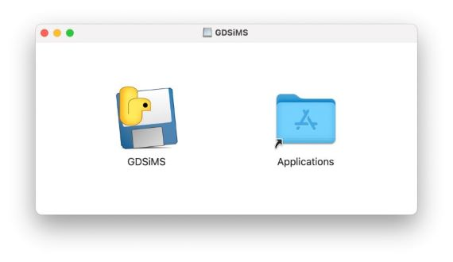

.. _gui-install:

Installation
============

GDSiMS GUI is currently available for Windows 10 and 11 and ARM-based Macs (Apple Silicon) via the Releases tab on the right-hand side of the `repository <https://github.com/AceRNorth/gdsims-gui>`_. Click on the latest release and scroll down to download the appropriate asset for your system. 

.. image:: ../images/gui_install_github_releases.png
    :scale: 50 %

.. image:: ../images/gui_install_github_assets.png
    :scale: 50 %

Output file locations are discussed in the :ref:`gui-usage` page.

Windows
-------

1. Download the ``GDSiMS_Win.zip`` folder. 

2. Extract all the files from the ZIP folder (i.e. unzip the folder). You can do this by right-clicking on the folder and selecting "Extract all".

3. Double-click the ``GDSiMS.exe`` file to open.

Note: Windows Defender may pop up when attempting to run the executable. This is because it doesn't recognise the distributor. The application is safe, so you can click on 'More info' and then 'Run anyway'.

Mac (ARM-based, i.e. Apple Silicon)
-----------------------------------

.. hint::
    How do I know whether my Mac is ARM-based? 

    This refers to the computer chip architecture of your Mac. Generally, all newer Macs released since November 2020 have the new ARM architecture - these are the new Apple M1, M2, ... chips. Older Macs have Intel chips. You can check this on your system by clicking on the Apple icon menu and clicking on 'About this Mac'. Look for the Chip section - if it says it's an Apple chip, your system is compatible with our GUI. If it says Intel, it is unfortunately not compatible (though do let us know if you are interested in development of a compatible version!).

1. Download the ``GDSiMS_Mac.dmg`` file and double-click to open it. 

2. The DMG file will open a prompt, asking you to drag the GDSiMS application into your Applications directory (you have to physically drag the icon into the other icon). This will install it as an app onto your system. 

3. Look for your Applications folder using the Finder and find the GDSiMS app. Double-click to open it.

When clicking to run, you may get a warning saying "GDSiMS not opened - Apple could not verify "GDSiMS" is free of malware that may harm your Mac or compromise your privacy". If so, click Done. This warning can be bypassed by following these short `instructions <https://support.apple.com/en-gb/guide/mac-help/mchleab3a043/mac>`_. You should then be able to run the app normally.

You can now go to the :ref:`gui-usage` page to learn how to use our GUI!