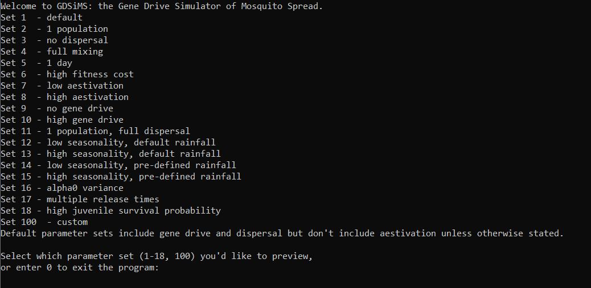
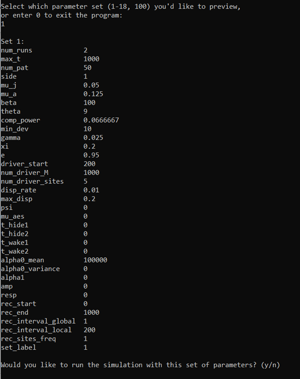
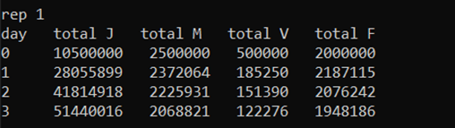
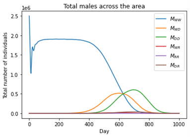

.. _tutorial-1:

1. Running a pre-defined set 
============================

This tutorial will describe how to run the model with a default set of parameters and create some simple plots from the output data. 

1.1 First run
-------------

To run the program, open the command prompt and change the directory ``cd`` to that of the executable file ``gdsimsapp``. Then, run the application. This step will look different depending on your operating system. For example, on Windows:

.. code-block:: bash

    cd C:\Users\MyUser\Projects\gdsims\build
    gdsimsapp.exe

This will display the command-line interface:

The interface provides default sets of parameters to demonstrate specific behaviours. Let's try running set 1. 

Upon entering ``1``, the program will give us a preview of the set 1 parameters (the full explanation of parameters can be found in the :class:`InputParams` documentation - we will introduce some of these in the following tutorials). Since we're happy with these parameters, we can enter ``y`` to run the program.

This will run the simulation, displaying some data to show how the simulation is progressing:

.. note::

    The data will take a while to start showing on screen at the start of each run. This is because the simulation implicitly runs what is known in computational modelling as a 'burn-in period'. This is a period of time given to the populations being modelled so they can reach a stable equilibrium, before any interventions can be applied to them. In our model, the burn-in period is 1 year (365 days). We discard this data and start recording from here.

On the first column we have the simulation day. This will run up to 1000 days, since we have chosen ``max_t`` = 1000. The following four columns display the total number of juvenile mosquitoes (J), adult male mosquitoes (M), adult virgin (unmated) females (V) and adult (mated) females (F). 

Since this set includes two repetitions (``num_runs`` = 2), the days will restart upon the second repetition.

At the end of the simulation we'll be able to see the program runtime.

Looking at the output data
^^^^^^^^^^^^^^^^^^^^^^^^^^

The program run will have created a new subdirectory in our ``build`` directory called ``output_files``. This contains all the output files generated by the program. There are text files of three types:

- ``CoordinateList.txt``: contains the (x, y) coordinates of all the patches in the simulation (in our set 1 we used ``num_pat`` = 50).
- ``Totals.txt``: contains the total adult mated female mosquito numbers across all patches as simulation time passes. These are divided into the different genotypes available (more information on genotypes in Tutorial :ref:`tutorial-3.2`).
- ``LocalData.txt``: contains the adult mated female mosquito numbers, divided by genotype, at each patch over time.

The program will generate a set of these files for each repetition (also called run).

.. _tutorial-1.2:

1.2 Simple plots: coordinates and totals (optional - python)
------------------------------------------------------------

The output files we have obtained can be plotted in various ways. Let's look at how to make some simple plots on Python. Feel free to skip this vignette if you'd like to use a different language.

The ``plot`` directory you cloned from GitHub will contain a plotting library called ``gdsimsplotlib.py`` we can use for gdsims-specific plots. The plotting library is colour-blind friendly.

We can install the required Python modules below and create our own script file **in the** ``plot`` **directory.**

.. note::

    We recommend creating our script file in the same directory as the plotting library file so Python can easily find it. If you're familiar with importing custom libraries and filepaths feel free to choose your own location. You may need to modify the filepaths in subsequent examples.

.. admonition:: Required installations for this tutorial

   - python (and a suitable IDE)
   - :py:mod:`numpy` package
   - :py:mod:`matplotlib` package

In our script we can import the library at the top using

.. code-block:: python

    import gdsimsplotlib as gdp

Plotting the coordinates
^^^^^^^^^^^^^^^^^^^^^^^^

The following code will plot the patch coordinates for run 1 of the set we just ran. Make sure to change the directory after the imports to **your** ``output_files`` path so the files can be found. The path below is just an example.

.. note:: 

    If you're using Windows, filepaths will need to be slightly modified so Python can read them. This is explained further `here <https://www.sqlpey.com/python/solved-how-to-properly-write-a-windows-path-in-a-python-string-literal/>`_. The simplest way is to use the first raw string method presented. This will work with filepaths that have spaces in them.

    Examples will use Windows filepaths in this way - if you're using Mac/Linux ignore the ``r`` before filepaths and just copy your filepath.

.. code-block:: python

    import gdsimsplotlib as gdp
    import os

    os.chdir(r"C:\Users\MyUser\Projects\gdsims\build\output_files")  # change the current directory to the output_files directory
    gdp.plot_coords("CoordinateList1run1.txt")
    # gdp.plot_coords("CoordinateList1run1.txt", title="Patch locations - set 1 run 1")  # optional argument for the plot title. The default is "Patch locations".

At the end we have added an extra (commented out) example with an optional argument for the plot title. For example, here we may want to specify the parameter set and run number we've used. All plotting functions have this optional title argument with their respective default plot titles. You can check what these defaults are and what function arguments are available in the ``gdsimsplotlib.py`` in-file function documentation. If you'd like an empty title you can pass the argument an empty string "".

This script will generate the following plot:

.. image:: ../images/tut1_coords_plot.png
    :scale: 80 %

Now we can see the spatial distribution of the patches!

.. note::
    Plots may look slightly different on different systems due to differences in random number generation in the model between systems. Output data for these tutorials has been generated on a Windows 10 with g++ compiler v13.1.0.

Plotting total females over time
^^^^^^^^^^^^^^^^^^^^^^^^^^^^^^^^

The following code will plot the total adult mated female mosquito numbers for the first run of set 1.
We can plot several lines corresponding to the different genotypes so we can observe the changes in genotypic composition over time.

.. code-block:: python
    
    import gdsimsplotlib as gdp
    import os

    os.chdir(r"C:\Users\MyUser\Projects\gdsims\build\output_files")  # change the current directory to the output_files directory
    gdp.plot_totals_genotype("Totals1run1.txt")
    gdp.plot_totals_genotype("Totals1run1.txt", sum_lines=True, title="Total females across the area by genotype - set 1 run 1")  # optional argument sum_lines. Describes whether summation lines for all genotypes and mosquito genotypes capable of malaria transmission will be plotted. The default is False.

Notice we have called the function twice, specifying some optional arguments on the second call. Extra lines can be added to the plot to view summed totals for all genotypes together (WW + WD + DD+ WR + RR + DR) and for those genotypes capable of malaria transmission (WW + WD + WR). This is set to False by default so as to not overcrowd the plot unnecessarily. We will explain further about the genotypes being modelled in tutorial section :ref:`tutorial-3.2`.

This script will generate the following plots:

We can now clearly see how the composition of the overall mosquito population evolves over time!

.. tip::

    You can also similarly use the ``plot_totals_allele_freq()`` function to plot the totals across the area by allele frequency (wild, drive and resistance alleles). We won't cover this in the tutorials but you can check its in-function documentation on the same ``gdsimsplotlib.py`` file.

.. tip::

    All **plotting** functions (not animation functions) in the plotting library return a matplotlib Figure object which you can modify further if needed. Always check the in-function documentation as some may return this figure as part of a tuple with other values. Refer to `matplotlib's docs <https://matplotlib.org/stable/api/figure_api.html#module-matplotlib.figure>`_.
