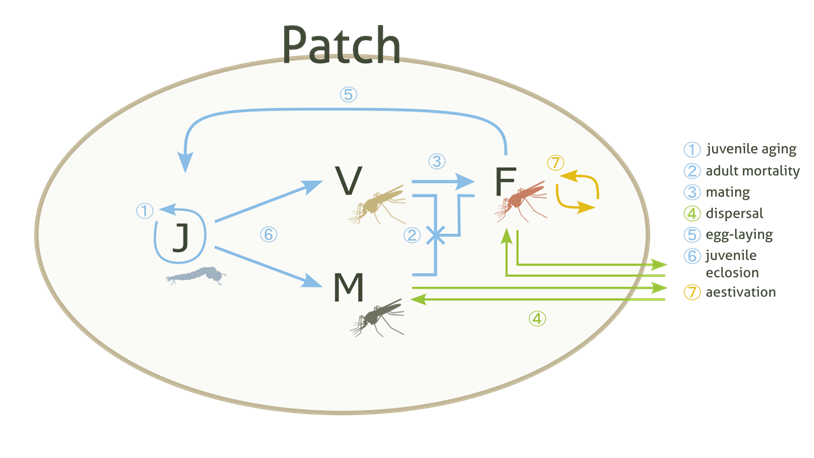
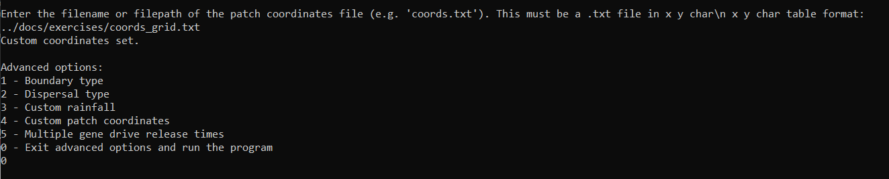
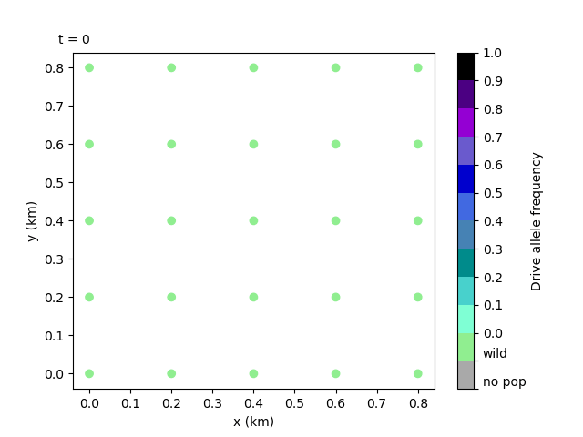

3. Setting coordinates and release sites
========================================

In this tutorial we give bite-sized introductions to some of the essential components of the model: patches and gene drive. Feel free to skip these sections if you're familiar with these concepts. However, they do provide some of the assumptions specific to our model. We then cover how to set your own Patch coordinates and gene drive release sites, and how to visualise the release as an animation. 

3.1 Model introduction: Patch
-----------------------------

The :class:`Patch` component is the essential building block of the model. It represents a population of mosquitoes mating, aging, dying… carrying out all the essential behaviours of a living, breathing population. As we've seen, the mosquitoes are divided into four types of individuals: juveniles (J), adult males (M), adult unmated (virgin) females (V) and adult mated females (F). Juveniles do not have a specific sex in the model - they are turned into adult males and adult (unmated) females upon eclosion (more information in the ``juv_eclose()`` function documentation of the :class:`Patch` class).

These populations (or Patches) are assigned some coordinates and arranged on a 2D simulated area, where, following metapopulation ecology theory, they interact with each other through dispersal mechanisms.

.. _tutorial-3.2: 

3.2 Model introduction: Gene drive
----------------------------------

Gene drive is a real-life technology that enhances the inheritance rates of certain genetic traits. In the case of our model, gene drive is applied to the mosquitoes, rapidly selecting for traits that will eventually suppress the overall population numbers. 

To start the gene drive process, a number of modified mosquitoes are released into the wild populations. We would usually select a specific number of patches for it to be released into. The drive mosquitoes then mate with wild mosquitoes and carry out the same life processes as them. They will disperse too, which causes the natural spread of the drive throughout the simulation area. 

We need to expand on the Patch concept to track the gene drive and so, the four types of individuals in a Patch are subdivided into several genotypes - let's consider six genotypes as this is the current default. These are composed of three different alleles: wild-type (W), drive-type (D) and non-functional resistance-type (R). We thus have the following genotypes available: WW, WD, DD, DR, WR and RR, which we already plotted as part of our first run!

.. note:: 
    We count six genotypes and not nine because WD and DW genotypes are counted together, and likewise for the other heterozygous genotypes.

.. _tutorial-3.3:

3.3 Setting your own Patch coordinates
--------------------------------------

Now we can repeat our first run but, instead of randomly generating patch coordinates by default, we will set our own. To do this, we will need to select a custom run to be able to access the advanced options. 

Create a file that contains these parameters:

.. collapse:: Parameters

    .. code-block::
        :caption: docs/exercises/params_set101.txt

        1
        1000
        25
        0.05
        0.125
        100
        9
        0.0666666666666666
        10
        0.025
        0.2
        0.95
        50
        5000
        1
        0.01
        0.25
        0
        0
        0
        0
        0
        0
        100000
        0
        0
        0
        0
        0
        1000
        1
        1
        1
        101

 
And, as before, enter the filepath for the parameters file (this time ``params_set101.txt``) into the program. Remember these exercise files can be found in the ``docs/exercises`` directory and the filepath we use is relative to the ``build`` directory, so we would enter ``../docs/exercises/params_set101.txt`` for this tutorial. 

Now we can say yes to the advanced options and we'll be given a submenu of options. Let's choose ``4`` - the custom patch coordinates option. 

.. image:: ../images/tut3_adv_options.png
    :scale: 80 %

The interface will then prompt us to enter a coordinates filename. Let's have a quick look at what this file should look like before proceeding with the run.

The custom coordinates file should have three columns - the x and y coordinates plus a ``y`` / ``n`` character. The last character describes whether the coordinate is a gene drive release site or not (yes or no).

As in other parameter files, each row should be delimited by new lines and each value in a row by white space. 

The coordinate values may also be subject to certain bound checks - more information on this in the :doc:`../user_guide/adv_options` section of the User Guide. 

.. warning::
    Selecting release sites in this way will overwrite the number of release sites previously chosen with the ``num_driver_sites`` parameter. 

Let's use the coordinates file below to create a square grid of patches. 

.. collapse:: Coordinates
    
    .. code-block:: 
        :caption: docs/exercises/coords_grid.txt

        0.0    0.0    n
        0.2    0.0    n
        0.4    0.0    n
        0.6    0.0    n
        0.8    0.0    n
        0.0    0.2    n
        0.2    0.2    n
        0.4    0.2    n
        0.6    0.2    n
        0.8    0.2    n
        0.0    0.4    y
        0.2    0.4    n
        0.4    0.4    n
        0.6    0.4    n
        0.8    0.4    n
        0.0    0.6    n
        0.2    0.6    n
        0.4    0.6    n
        0.6    0.6    n
        0.8    0.6    n
        0.0    0.8    n
        0.2    0.8    n
        0.4    0.8    n
        0.6    0.8    n
        0.8    0.8    n

Now we can enter the filepath into the prompt. Like with the parameters file, we can use the relative filepath to the ``docs/exercises`` directory. If there are no error messages, this will set the coordinates (more information on errors in the :doc:`../user_guide/custom_set` and :doc:`../user_guide/adv_options` sections of the User Guide).

We can exit the advanced options and run the program by entering ``0``, which should start outputting day data as in previous runs. 

Finally, we could re-plot the coordinates and check the difference, but we will leave this as an exercise for the user. 

3.4 Creating a local data animation: drive allele frequency (optional - python)
-------------------------------------------------------------------------------

.. note:: 

   This tutorial will require the same installations as Tutorial :ref:`tutorial-1.2`.

With a few tweaks we can easily transform our previous population size animation into an animation of the drive allele frequency to track the spread of the gene drive. 

The drive allele (D) frequency is calculated relative to all available genotypes:

.. math:: 

    \text{drive allele freq.} = \frac{\mathrm{WD} + 2(\mathrm{DD}) + \mathrm{DR}}{2(\mathrm{TOT})}

with :math:`\textrm{TOT} = \textrm{WW} + \textrm{WD} + \textrm{DD} + \textrm{WR} + \textrm{RR} + \textrm{DR}`. Each genotype in the equation represents the total number of mated females of that genotype in the overall area.

To make this animation, you can either use the script cell ``GeneralMetapopPlots.py - 'Spatial animation of gene drive allele frequency'`` found in the ``test`` directory, or follow along in editing the animation script from Tutorial :ref:`tutorial-2.2`. If you're using the script directly, you can skip to the animation image. 

To modify our previous animation script, we can substitute some of the sections marked with special characters. First, we're going to substitute the section enclosed by ``# - - - - -``  with the following code, which calculates the drive allele frequency for the first day and creates the initial scatter plot with our own discrete colourmap:

.. collapse:: First section of script

    .. code-block:: python
        :caption: section from test/GeneralMetapopPlots.py - 'Spatial animation of gene drive allele frequency'

        WW_day0 = local_data_day0[:, 0]
        WD_day0 = local_data_day0[:, 1]
        DD_day0 = local_data_day0[:, 2]
        WR_day0 = local_data_day0[:, 3]
        RR_day0 = local_data_day0[:, 4]
        DR_day0 = local_data_day0[:, 5]

        # calculate drive allele frequency for each patch
        drive_freq = np.zeros(len(x))
        for pat in range(0, len(x)):
            tot = WW_day0[pat] + WD_day0[pat] + DD_day0[pat] + WR_day0[pat] + RR_day0[pat] + DR_day0[pat]
            if (tot == 0):
                drive_freq[pat] = -2 # assign different distinguishable value for no-population patches
            elif (tot == WW[pat]):
                drive_freq[pat] = -0.5 # assign different distinguishable value for fully wild-population patches
            else:
                drive_freq[pat] = (WD_day0[pat] + (2*DD_day0[pat]) + DR_day0[pat]) / (2*tot)

        # define discrete colourmap
        main_cmap = ['aquamarine', 'mediumturquoise', 'darkcyan','steelblue', 'royalblue', 'mediumblue', 'slateblue', 'darkviolet', 'indigo', 'black']
        all_colours = ['darkgray', 'lightgreen'] + main_cmap # add colours for no-population patch and wild-population patch
        cmap = mcolors.ListedColormap(all_colours)
        bounds = [-2, -1, 0, 0.1, 0.2, 0.3, 0.4, 0.5, 0.6, 0.7, 0.8, 0.9, 1.0]
        cnorm = mcolors.BoundaryNorm(bounds, cmap.N)

        # make a scatter plot with drive frequency colour map
        scat = ax.scatter(x, y, c=drive_freq, cmap=cmap, norm=cnorm, marker='o')
        cbar = fig.colorbar(scat, ax=ax, label='Drive allele frequency')
        cbar.ax.set_yticks([-2, -1, 0.0, 0.1, 0.2, 0.3, 0.4, 0.5, 0.6, 0.7, 0.8, 0.9, 1.0], labels=['no pop', 'wild', '0.0', '0.1', '0.2', '0.3', '0.4', '0.5', '0.6', '0.7', '0.8', '0.9', '1.0'])
        labels = cbar.ax.get_yticklabels()
        labels[0].set_verticalalignment('bottom') # align first label text above the tick 
        labels[1].set_verticalalignment('bottom')

Secondly, we're going to substitute the section enclosed by ``# ~ ~ ~ ~ ~`` with a section that updates the scatter plot to our new drive allele frequency values:

.. collapse:: Second section of script

    .. code-block:: python 
        :caption: section from test/GeneralMetapopPlots.py - 'Spatial animation of gene drive allele frequency'`

            WW = local_data_day[:, 0]
            WD = local_data_day[:, 1]
            DD = local_data_day[:, 2]
            WR = local_data_day[:, 3]
            RR = local_data_day[:, 4]
            DR = local_data_day[:, 5]

            drive_freq = np.zeros(len(x))
            for pat in range(0, len(x)):
                tot = WW[pat] + WD[pat] + DD[pat] + WR[pat] + RR[pat] + DR[pat]
                if (tot == 0):
                    drive_freq[pat] = -2
                else:
                    drive_freq[pat] = (WD[pat] + (2*DD[pat]) + DR[pat]) / (2*tot)

        scat.set_array(drive_freq) # update the scatter point colours according to new drive_freq

    .. caution:: 

        This section should all be indented within the ``update()`` function.

You'll also likely want to change the interval on the animation to 20 ms, since we have a lot more recorded days to cycle through.     

Finally, remember too to change the CoordinateList and LocalData files to match the set we have just used, ``101``!

Our new updated script should produce the following animation:

The animation clearly shows the spread of the gene drive and the subsequent collapse of the populations - note how the drive mosquitoes are released into the left edge central patch and spread, not only towards the right, but also appear from the right edge of the plot! This is because of the toroidal boundary conditions the model uses by default - we'll get into more detail in the next tutorial.