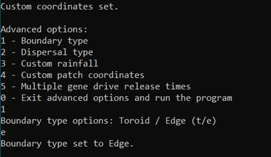
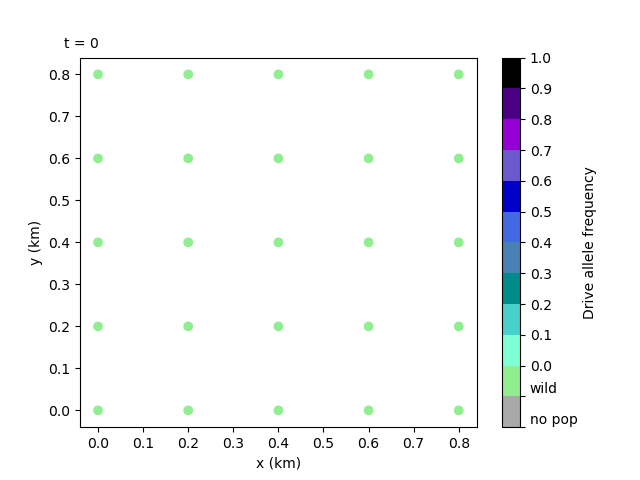

4. Setting the boundary type
============================

As we saw in the previous animation, using toroidal boundary conditions (BCs) means that the mosquitoes can disperse from one edge of the plot to the other. This is because the axis loops around on itself like a donut (toroid). This is quite useful in theoretical applications where we want a continuous area, which cannot realistically be modelled large enough otherwise. In our model, the BCs are applied to both x and y axes.

This tutorial will describe how to set the boundary type to edge, where the axes are no longer looped around, and what this means for the gene drive spread. 

4.1 Setting the boundary type to Edge
-------------------------------------

To set more realistic BCs, we can choose to run the model with edge BCs. Simply select this in the advanced options menu. 
As before, input your custom parameter and coordinates files (we will use the same files as Tutorial :ref:`tutorial-3.3`). After setting the coordinates the interface will return to the advanced options menu, giving us the chance to set more options. 
We can now choose option ``1 - Boundary type``. And enter ``e`` for Edge. 

That's it! All that's left is running the program.
With our output files, we can repeat the animation from the previous vignette and observe the changes. 

We can see how the drive mosquitoes aren't jumping from left to right edge anymore, and it thus takes longer for the gene drive to spread across the simulation area. 