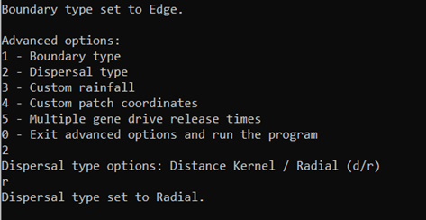
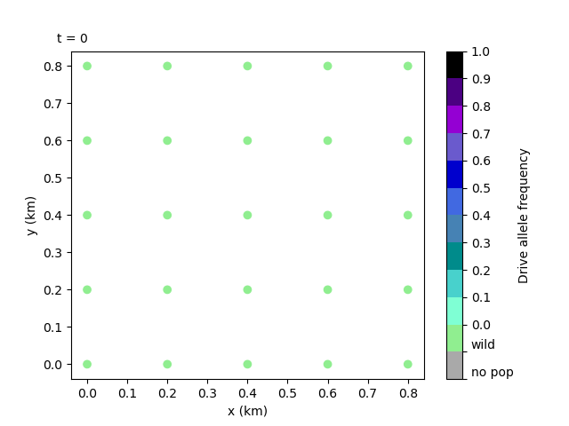

6. Setting the dispersal type
=================================

In this tutorial we give a bite-sized introduction to another component of the model: dispersal. Feel free to skip this section if you're not ready for model details yet. However, it does provide some of the assumptions specific to our model and explain a bit more about the dispersal parameters. We then see how to set a different dispersal type to the default.

6.1 Model Introduction: Dispersal
---------------------------------

Distance-kernel Dispersal
^^^^^^^^^^^^^^^^^^^^^^^^^

We know that mosquitoes disperse between patches, but we haven't covered exactly how and to what extent, as this could be implemented in many ways.

In the model, patches are deemed to be connected to one another for dispersal if they satisfy some conditions. One of these is the maximum dispersal distance allowed, ``max_disp``. In the simplest version of dispersal, if the second patch is at a shorter distance than ``max_disp`` from the first patch, the second patch will be connected to the first. Likewise, the first patch would be connected to the second. The connection weight will just be the difference between ``max_disp`` and the actual distance, 

.. math::
    \text{weight} = \text{max_disp} - \text{distance}.

We call this dispersal type distance-kernel, which is the default.

Another parameter we consider is the dispersal rate, ``disp_rate``, which defines the rate at which mosquitoes disperse out of every patch, i.e. how many individuals relative to their total number will leave their patch in search of a new one.

Radial dispersal
^^^^^^^^^^^^^^^^

Another available dispersal type is the radial dispersal, which gives a more advanced and realistic implementation of dispersal. 

The grey circle below represents the maximum dispersal area available for connections to the central patch. All other patches within this circle are connected to the central patch. With Radial dispersal, mosquitoes disperse in set directions out of their patch. Those that set out in a direction with no patches will die (as opposed to Distance Kernel, where dispersing mosquitoes are guaranteed a connected patch to disperse to). The rest will disperse to the nearest patch in their set direction. Thus, some of the connected patches will have zero or reduced connection weight to the central patch, as they will be blocked by closer patches.

.. image:: ../images/tut6_radial_disp_diagram.png
    :scale: 70 %

More details on dispersal types can be found in the :doc:`../user_guide/adv_options` section of the User Guide.

6.2 Setting the dispersal type to Radial
----------------------------------------

To set the dispersal type to Radial, we can once again use the advanced options of a custom run. We will build upon  Tutorial :ref:`tutorial-4.1`, using the same parameter set and custom coordinates, as well as an Edge boundary. These options may often be used together, as they create the most realistic setting for the model.

After selecting all the previous advanced options, select option ``2 – Dispersal type``. This will prompt us to choose between Distance Kernel and Radial. Choose Radial ``r``.

With this, we're ready to run. From the output files we can create another animation as below to see the difference with the previous tutorial, which used the default dispersal type, Distance Kernel. 

Let's compare this animation to the one from Tutorial :ref:`tutorial-4.1`. We can see that in this case the gene drive will spread much quicker with the radial dispersal. 

.. note::

    More detail on dispersal types can be found in the :doc:`../user_guide/adv_options` page of the User Guide. It's important to note that the boundary type and dispersal type selected will interact to create nuanced differences in boundary conditions. This is discussed in the above page. 

