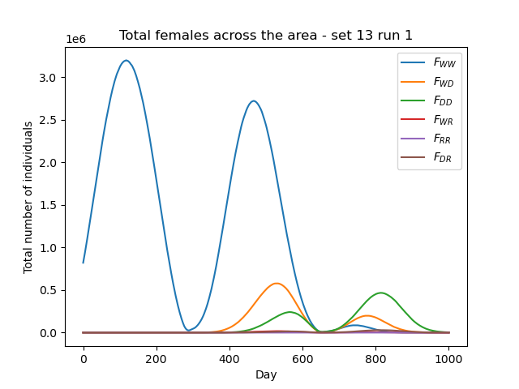
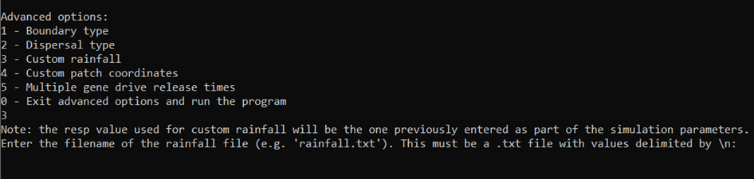

7. Customising seasonality
==========================

In this tutorial we will give a bite-sized introduction to seasonality and the types used in the model. As with previous tutorials, feel free to skip over this part if you're not ready for the model details. We then look at running the model with some default rainfall parameters, and finally look at setting our own rainfall data. 

.. _tutorial-7.1:

7.1 Model Introduction: Seasonality
-----------------------------------

To explore the concept of seasonality, we first need to explain the concept of carrying capacity. An environment can support a maximum size of stable population due to the limited number of resources it holds (stable meaning the population won't collapse). This maximum size is what we call the carrying capacity of the environment. Since mosquitoes lay eggs and grow as juveniles in standing water, the carrying capacity for their populations is highly dependent on water sources, such as rainfall. 

We can thus divide the carrying capacity :math:`\alpha` into two components, 

.. math::

    \alpha = \alpha_0 + \alpha_1 x, 

where :math:`\alpha_0` is the baseline for the carrying capacity and :math:`\alpha_1` is the factor for the rainfall contribution. The factor :math:`x` may vary depending on the way rainfall is modelled. More contributions to :math:`\alpha` can be added, such as the contributions of rivers and lakes, but we will ignore these to simplify the problem.

By default, we model the rainfall contribution as a sinusoid wave 

.. math::

    x = 1 + A \sin \left( \frac{2\pi d}{365} \right) , 

where :math:`A` is the amplitude of rainfall fluctuations and :math:`d` is the current day of the simulation.

We can also choose to include our own rainfall data, and model the rainfall contribution to carrying capacity as

.. math::
    x = 1 - e^{-\gamma r_d} , 

where :math:`\gamma` is the carrying capacity's responsiveness to the rainfall contribution and :math:`r_d` is the daily rainfall.

7.2 Running with default rainfall
---------------------------------

In our previous runs of the program we haven't included any rainfall contribution - you can easily check that the previous parameter sets had ``alpha1`` = 0. Let's run the program with some default rainfall so we can compare the output to other types of seasonality later.
We can choose one of the pre-defined sets - sets 12 and 13 could be good for this, let's choose 13. 

.. image:: ../images/tut7_set13.png
    :scale: 90 %

This is the high seasonality, default rainfall parameter set. Observe how ``alpha0_mean`` (the baseline) is very small compared to ``alpha1`` - this will ensure the population fluctuations due to rainfall (i.e. seasonality) are seen very clearly. We have also set a non-zero ``amp`` value for the amplitude of fluctuations.

With our output data, we can plot the total males as we did in Tutorial :ref:`tutorial-1.2`:

And as we can see, the population greatly fluctuates in a sinusoid pattern due to the rainfall contribution!

7.3 Setting a rainfall file
---------------------------

We can now input our own rainfall data to create a more realistic environment. This option is also covered by the advanced options menu of the custom run.

This time we will use the parameters below for the custom run, which include a non-zero value for ``resp``:

.. image:: ../images/tut7_set15.png
    :scale: 70 %
 
.. collapse:: Parameters

    .. code-block:: 
        :caption: docs/exercises/params_set15.txt

        2
        1000
        50
        1
        0.05
        0.125
        100
        9
        0.06666666666666667
        10
        0.025
        0.2
        0.95
        200
        1000
        5
        0.01
        0.2
        0
        0
        0
        0
        0
        0
        10
        0
        100000
        0
        1
        0
        1000
        1
        200		
        1
        15

When we later select the input rainfall option, the value of ``amp`` will be ignored as it only relates to the default rainfall behaviour, so we have set it to zero here. ``resp`` will define the responsiveness to the fluctuations for our input rainfall model. 

Now, let's choose advanced option ``3 - Custom rainfall``. 

This will prompt us to enter a rainfall file - let's have a brief look at what this file should look like.

The file should contain a daily rainfall value for every day of a year. The example below (modified from ``rainfall.txt`` in the GitHub ``docs/exercises`` directory) has been shortened with ellipsis for illustrative purposes - in the original file it repeats the same value for every day of the month to serve as a simple example. The values should be delimited by new lines.

.. collapse:: Rainfall example

    .. code-block::
        :caption: shortened version of docs/exercises/rainfall.txt

            0.0
            …
            0.0
            0.0
            …
            0.0
            0.15
            …
            0.15
            0.35
            …
            0.35
            0.65
            …
            0.65
            2.0
            …
            2.0
            4.35
            …
            4.35
            5.8
            …
            5.8
            2.65
            …
            2.65
            0.3
            …
            0.3
            0.0
            …
            0.0
            0.0
            …
            0.0

With this number of values, the program will infer that we want to cycle them yearly. We also have the option to include daily values for every day we're simulating instead, i.e. for a ``max_t`` number of days.

Finally, enter the filepath and proceed to run the program. Remember again that input file filepaths must be relative to the ``build`` directory.

.. image:: ../images/tut7_confirm.png

If we plot the total males again, we can observe that the fluctuations are more irregular than before, since our custom rainfall values don't follow a perfect sinusoid pattern. 

.. image:: ../images/tut7_totals_plot_set15.png
    :scale: 80 %

In this tutorial we have effectively run the pre-defined set 15! 

