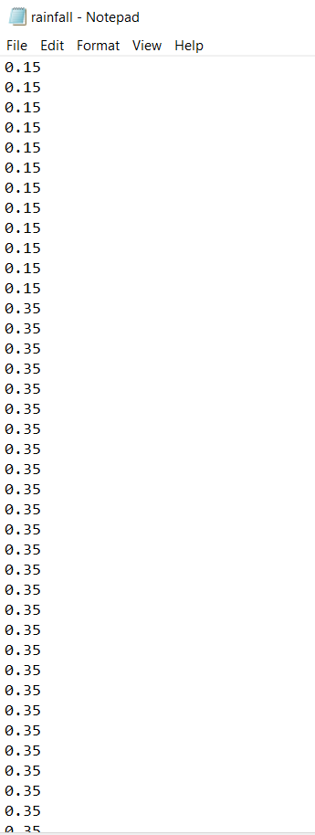
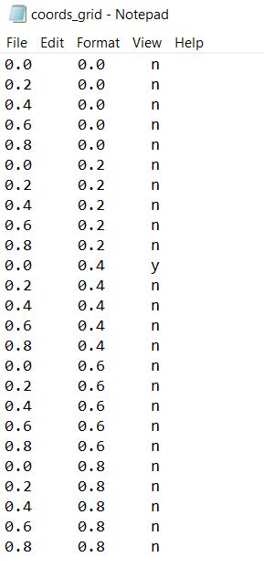

Advanced options
================

Advanced options can be set beyond the required input parameters, both through the command-line interface (CLI) and by interacting through code. If you'd like to set many advanced options, particularly as their number grow with the project, we'd recommend looking at the :doc:`code` section.

This page covers the specifics of the different types of advanced options - for details on the functioning of the advanced options menu of the CLI, refer to the relevant subsection in :doc:`custom_set`.

.. note::
    Advanced options that have been set apply to all repetitions (runs) of a single simulation. 

.. caution::
    Advanced options will typically give an error message if the setting process has been unsuccessful. If they are not re-set successfully before running the simulation the option will maintain its default behaviour - visit :doc:`defaults` to see the defaults. 

.. caution::
    For options requiring input files, once the advanced behaviour has been successfully set the default behaviour cannot be reset. Only new files can be provided for resets. If one of these resets fails, the program will default to the last successful attempt - if none were successful, the original default behaviour will be maintained.

Boundary type
-------------

The boundary type of the model area can be modified. This means modifying the type of boundary conditions applied to the boundaries of the simulation area. Two boundary type options currently exist:

- Toroid (default)
- Edge

Toroid type translates to toroidal (also known as periodic) boundary conditions on all edges. This is useful for theoretical applications where edge effects are undesirable. 

Edge type will apply non-periodic boundary conditions.

.. seealso::
    Tutorial :doc:`../tutorials/tutorial4`

    Model introduction on boundary types and tutorial on setting the boundary type using the CLI

    :class:`BoundaryStrategy`
    
    Class documentation (with links to derived classes)

    :doc:`defaults`

    User guide page on default model options, including the default boundary type.

.. note::

    See Dispersal type section below for details of how different boundary types and dispersal types interact to create different boundary conditions. 

Dispersal type
--------------

The dispersal type of the model influences how dispersal connectivities between patches are calculated and other aspects of dispersal such as dispersal mortality. Two dispersal type options currently exist:

- DistanceKernel (default)
- Radial

+----------------+-------------------------------+------------------------+------------------------+---------------------------------------------+
| Dispersal type | All neighbour patches within  | Mosquitoes disperse to | Dispersal mortality    | Connection weight                           |
|                | max disp distance are         | *every* connected      |                        |                                             |
|                | connected to the focal patch  | patches                |                        |                                             |
+================+===============================+========================+========================+=============================================+
| DistanceKernel |       |checkmark|             |     |checkmark|        |             X          | :math:`\text{weight = max_disp - distance}` |  
+----------------+-------------------------------+------------------------+------------------------+---------------------------------------------+
| Radial         |       |checkmark|             | X                      | |checkmark|            | Determined by the                           |
|                |                               |                        |                        | angle of bisecting                          |
|                |                               | connection to some     | mosquitoes setting     | lines from the                              |
|                |                               | patches may be blocked | out in directions with | centre of the focal                         |
|                |                               | or reduced by closer   | no patches will die    | patch to the                                |
|                |                               | patches                |                        | catchment of the                            |
|                |                               |                        |                        | receiving patch (see                        |
|                |                               |                        |                        | fig)                                        |
+----------------+-------------------------------+------------------------+------------------------+---------------------------------------------+

.. figure:: ../images/tut6_radial_disp_diagram.png
    :scale: 70 %
    :align: left

    Radial dispersal - the grey circle represents the maximum dispersal area for the central focal patch. The orange triangles are drawn from bisecting lines from the centre of the focal patch to the catchment radius of the receiving patch. The angle between these two lines determines the connection weight of the receiving patch to the focal patch. Patches connected with yellow triangles have reduced connection due to closer patches. Those with no triangles associated but still within the grey area have been fully blocked by closer patches. They are thus connected to the focal patch but with zero connection weight. 

.. note::

    Different combinations of dispersal type and boundary type interact to create boundary conditions with nuanced differences.

    A toroidal boundary type is not absorbing or reflective - each axis is treated as continuous space, where mosquitoes enter one side of the boundary and come out the other in the same original direction. The Edge boundary type is more nuanced, depending on the dispersal type selected. 
    
    With a distance kernel dispersal type, mosquitoes simply travel between connected patches. This means that connections are formed across boundaries with a Toroid boundary type, whereas they're not formed in this way with an Edge boundary type (thus, neither absorbing nor reflecting). However, with a Radial dispersal type the mosquitoes will also travel in all outward directions from the initial patch, not just directly to connected patches (and thus may die if dispersal is unsuccessful). This means that a Radial dispersal type with an Edge boundary type effectively makes an absorbing boundary (all mosquitoes crossing the boundary will die). This is not the case for the Toroid boundary as, though mosquitoes may die when travelling through the boundary, they may still successfully travel to a connected patch on the other side.

More information on how dispersal is modelled can be found in the links below.

.. seealso::
    Tutorial :doc:`../tutorials/tutorial6`

    Model introduction on dispersal types and tutorial on setting the dispersal type using the CLI

    :class:`Dispersal`

    Class documentation (with links to derived classes)

    :doc:`defaults`

    User guide page on default model options, including the default dispersal type.

Custom rainfall
---------------

In addition to the default seasonality option provided, where rainfall contribution to carrying capacity is modelled as a sine wave, a custom rainfall contribution can be applied by providing a file of rainfall data. An introduction to how this is modelled (with equations) is included in the tutorial linked below. 

.. warning::
    This advanced option will use the input parameters ``alpha1`` and ``resp`` previously provided and ignore ``amp``. Make sure to set these values as needed before proceeding to the advanced options menu.

Similarly to the custom set :ref:`custom_params_file`, this advanced option asks for an input file. The filename will follow the same rules as the parameter file, as so will any other input files required by other advanced options.

.. _rainfall_file:

Rainfall data input file
^^^^^^^^^^^^^^^^^^^^^^^^

The rainfall file contains daily rainfall values. From the number of values provided the program will infer how we want to use these, either:

- One year of rainfall data (365 values) - these will be cycled yearly in the simulation
- Rainfall data for every day of the simulation (``max_t`` values) - these will not be cycled.

Any other number will give an error. 

The file should contain a list of values separated by new lines. 

.. seealso::
    Tutorial :doc:`../tutorials/tutorial7`

    Model introduction on seasonality and tutorial on setting custom rainfall using the CLI

    :class:`Seasonality`

    Class documentation (with links to derived classes)

.. _coords_custom_file:

Custom patch coordinates
------------------------

Instead of randomly generating coordinates, custom Patch coordinates can be set through a file.
Through the same file we can also choose specific gene drive release sites to customise the release further.

.. note::
    Setting specific release sites will change the mode of release from random to scheduled. This means the specified release sites will be used for *each* of the releases (if using multiple release times). Mosquitoes will be released at *all* release sites for each release time.

Coordinates input file
^^^^^^^^^^^^^^^^^^^^^^

The file should be composed of three columns of data. The first two are the *x* and *y* coordinates respectively for
the given patch, and the third one indicates whether the patch will be a release site (y/n for yes/no). The values
in a row should be separated by white space and the rows separated by new lines.

.. seealso::
    Tutorial :ref:`tutorial-3.3`

    Tutorial on setting custom patch coordinates using the CLI

    :class:`GDRelease`

    Class documentation (with links to derived classes)

.. _release_times_file:

Multiple gene drive release times
---------------------------------

To further customise the gene drive release, multiple release times can be set, as the default is to release on a single day.
This advanced option can be used in conjunction with the custom coordinates (and specific release sites) option but can otherwise be used on its own.

.. note::
    When setting release times through a file, the input parameter ``driver_start`` previously entered will be ignored.

Release times input file
^^^^^^^^^^^^^^^^^^^^^^^^

The release times file should contain values separated by new lines, which are within ``max_t``.

.. seealso:: 
    Tutorial :doc:`../tutorials/tutorial5`

    Tutorial on setting multiple release times using the CLI

.. |checkmark| unicode:: U+2713
    :trim:

