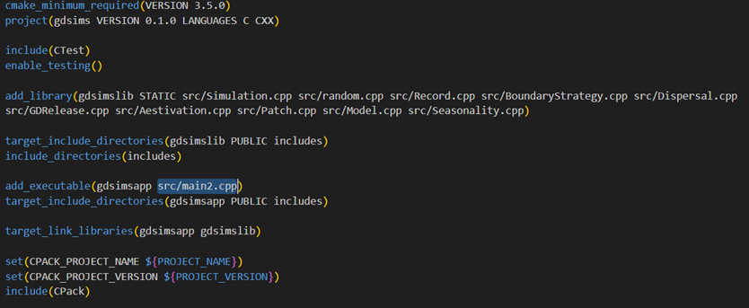

Interacting through code
========================

The program architecture has been designed to flexibly provide different ways of running the program. For more advanced users, making custom parameter set runs with many advanced options may be quicker and easier by directly interacting with our :class:`Simulation` class through C++ code instead of using the built-in command-line interface (CLI). This also allows further customisation of parameter reading methods.

GDSiMS uses CMake as its build tool, with the corresponding CMakeLists file provided in our repository. We can easily substitute the executable file with our own user-defined source file (labelled as ``main2.cpp`` below). 

.. seealso::
    `CMake documentation <https://cmake.org/cmake/help/latest/>`_
     Documentation for CMake, including a User Interaction Guide.

.. caution::
    The CMake project will need to be re-built and re-compiled after making these changes (as explained in :doc:`../install`).

To run the simulation with the default parameters of set 1, ``main2.cpp`` would look like this:

.. collapse:: Pre-defined parameter set run
    :open:

    .. code-block:: c++

        #include "Simulation.h"
        #include "sets.h"

        int main() {
            Simulation simulation(set1);
            InheritanceParams inher;
            inher.gamma = set1.gamma;
            inher.xi = set1.xi;
            inher.e = set1.e;
            simulation.set_inheritance(inher);
            simulation.run_reps();
        }

``sets.h`` contains the same pre-defined parameter sets used in the CLI for a quick start.

The :class:`Simulation` class has different methods available to run the simulation and set :doc:`adv_options`. Of these, the two essential ones are ``set_inheritance()`` and ``run_reps()``, which set the inheritance fraction for each genotype and run the simulation (including all its repetitions) respectively. For information on other methods visit the class' documentation. 

To set all the advanced options, ``main2.cpp`` would look like this:

.. collapse:: Pre-defined parameter set run with advanced options set
    :open:
    
    .. code-block:: c++

        #include "Simulation.h"
        #include "sets.h"

        int main() {
            Simulation simulation(set1);
            InheritanceParams inher;
            inher.gamma = set1.gamma;
            inher.xi = set1.xi;
            inher.e = set1.e;
            simulation.set_inheritance(inher);
            simulation.set_boundary_type(Edge);
            simulation.set_dispersal_type(Radial);
            simulation.set_rainfall("rainfall.txt");
            simulation.set_coords("coords_grid.txt");
            simulation.set_release_times("rel_times.txt");
            simulation.run_reps();
        }

To create a custom parameter set, we can use the :class:`InputParams` structure, which defines all the parameters needed:

.. collapse:: Custom parameter set run with advanced options set

    .. code-block:: c++

        #include "Simulation.h"

        int main() {
            InputParams params;
            params.num_runs = 1;
            params.max_t = 1400;
            params.num_pat = 50;
            params.mu_j = 0.05;
            params.mu_a = 0.125;
            params.beta = 100;
            params.theta = 9;
            params.comp_power = 0.0666666666666666;
            params.min_dev = 10;
            params.gamma = 0.025;
            params.xi = 0.2;
            params.e = 0.95;
            params.driver_start = 100;
            params.num_driver_M = 1000;
            params.num_driver_sites = 1;
            params.disp_rate = 0.01;
            params.max_disp = 0.2;
            params.psi = 0.0;
            params.mu_aes = 0.0;
            params.t_hide1 = 0;
            params.t_hide2 = 0;
            params.t_wake1 = 0;
            params.t_wake2 = 0;
            params.alpha0_mean = 100000;
            params.alpha0_variance = 0.0;
            params.alpha1 = 0.0;
            params.amp = 0.0;
            params.resp = 0.0;
            params.rec_start = 0;
            params.rec_end = 1400;
            params.rec_interval_global = 1;
            params.rec_interval_local = 100;
            params.rec_sites_freq = 1;
            params.set_label = 100;

            Simulation simulation(params);
            InheritanceParams inher;
            inher.gamma = params.gamma;
            inher.xi = params.xi;
            inher.e = params.e;
            simulation.set_inheritance(inher);
            simulation.set_boundary_type(Edge);
            simulation.set_dispersal_type(Radial);
            simulation.set_rainfall("rainfall.txt");
            simulation.set_coords("coords_grid.txt");
            simulation.set_release_times("rel_times.txt");
            simulation.run_reps();
            return 0;
        }

And similarly to the pre-defined parameter set, we can set the advanced options before we run the simulation.

.. caution::
    The :class:`Simulation` constructor will not make bound or interval checks on the parameters. To see the allowed bounds for model parameters, visit the :doc:`custom_set` page. 

By modifying the ``main2.cpp`` file further, you can read the input parameters from a file. This feature is included by default in the CLI but it is understood that advanced users will want to define their own parameter reading method depending on their specific needs. 

.. tip::
    The ``inputval.h`` file in the project defines parameter file reading and bounds and interval checking functions used in the CLI which you may want to reuse. You will need to define the correct bounds for each parameter according to our :doc:`custom_set` page. 

