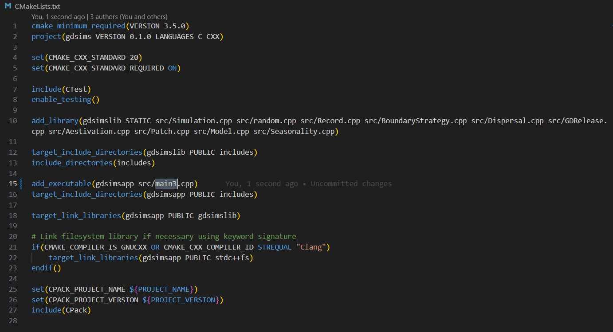

Interacting through code
========================

The program architecture has been designed to flexibly provide different ways of running the program. For more advanced users, making custom parameter set runs with many advanced options may be quicker and easier by directly interacting with our :class:`Simulation` class through C++ code instead of using the built-in command-line interface (CLI). This also allows further customisation of parameter reading methods.

GDSiMS uses CMake as its build tool, with the corresponding ``CMakeLists.txt`` file provided in our repository. We can easily substitute the source file for the command-line interface, ``main.cpp``, with our own user-defined source file (we can call this ``main3.cpp``). 

To do this:

1. Create a ``main3.cpp`` file in the ``src`` folder of your cloned repository. You can do this by opening a new file on the Notepad app on Windows or any other text editor and saving the file, making sure to include the ``.cpp`` extension in replacement of ``.txt``.

2. Edit the file and save - look at the next section to choose what you want to include.

3. Open the ``CMakeLists.txt`` file in your cloned repository, this should be in the ``gdsims`` top folder.

4. Edit the ``add_executable(gdsimsapp src/main.cpp)`` line, substituting ``src/main.cpp`` with ``src/main3.cpp``, and save.

5. Re-build and re-compile the project with CMake (repeat steps 5-6 of the Windows installation instructions or steps 7-8 of the Mac instructions at :doc:`../install`).

.. seealso::
    `CMake documentation <https://cmake.org/cmake/help/latest/>`_
     Documentation for CMake, including a User Interaction Guide.

.. caution::
    The CMake project will need to be re-built and re-compiled after making these changes (as explained in :doc:`../install`).

What to include in your main3.cpp file
---------------------------------------

To run the simulation with the default parameters of set 1, ``main3.cpp`` would look like this:

.. collapse:: Pre-defined parameter set run
    :open:

    .. code-block:: cpp

        #include "Simulation.h" // load our GDSiMS Simulation class
        #include "sets.h" // load the pre-defined sets data structures

        int main() {
            Simulation simulation(set1); // create a simulation object using parameter set 1 
            InheritanceParams inher; // create a data structure for the inheritance parameters
            inher.gamma = set1.gamma; // set the values of the above data structure to those from set 1 
            inher.xi = set1.xi;
            inher.e = set1.e;
            simulation.set_inheritance(inher); // set the inheritance fraction of our simulation object using our parameters
            simulation.run_reps(); // run the simulation with its repetitions
        }

``sets.h`` contains the same pre-defined parameter sets used in the CLI for a quick start.

The :class:`Simulation` class has different functions available to run the simulation and set :doc:`adv_options`. Of these, the two essential ones are ``set_inheritance()`` and ``run_reps()``, which set the inheritance fraction for each genotype and run the simulation (including all its repetitions) respectively. For information on other functions visit the class' documentation. 

The inheritance parameters are set separately to ensure these can be easily set by the user, in case these values are calculated using other models and need to be fed in. 

To set all the advanced options, ``main3.cpp`` would look like this:

.. collapse:: Pre-defined parameter set run with advanced options set
    :open:
    
    .. code-block:: cpp

        #include "Simulation.h"
        #include "sets.h"

        int main() {
            Simulation simulation(set1);
            InheritanceParams inher;
            inher.gamma = set1.gamma;
            inher.xi = set1.xi;
            inher.e = set1.e;
            simulation.set_inheritance(inher);
            simulation.set_boundary_type(Edge); // available options are Toroid (default) or Edge
            simulation.set_dispersal_type(Radial); // available options are DistanceKernel (default) or Radial
            simulation.set_rainfall("rainfall.txt"); // takes a filepath relative to the build folder
            simulation.set_coords("coords_grid.txt"); // takes a filepath relative to the build folder
            simulation.set_release_times("rel_times.txt"); // takes a filepath relative to the build folder
            simulation.run_reps();
        }

To create a custom parameter set, we can use the :class:`InputParams` data structure, which defines all the parameters needed:

.. collapse:: Custom parameter set run with advanced options set

    .. code-block:: cpp

        #include "Simulation.h"

        int main() {
            InputParams params; // create the input parameters data structure
            params.num_runs = 1; // set the value for the num_runs parameter, the number of runs in the simulation
            params.max_t = 1400;
            params.num_pat = 50;
            params.mu_j = 0.05;
            params.mu_a = 0.125;
            params.beta = 100;
            params.theta = 9;
            params.comp_power = 0.0666666666666666;
            params.min_dev = 10;
            params.gamma = 0.025;
            params.xi = 0.2;
            params.e = 0.95;
            params.driver_start = 100;
            params.num_driver_M = 1000;
            params.num_driver_sites = 1;
            params.disp_rate = 0.01;
            params.max_disp = 0.2;
            params.psi = 0.0;
            params.mu_aes = 0.0;
            params.t_hide1 = 0;
            params.t_hide2 = 0;
            params.t_wake1 = 0;
            params.t_wake2 = 0;
            params.alpha0_mean = 100000;
            params.alpha0_variance = 0.0;
            params.alpha1 = 0.0;
            params.amp = 0.0;
            params.resp = 0.0;
            params.rec_start = 0;
            params.rec_end = 1400;
            params.rec_interval_global = 1;
            params.rec_interval_local = 100;
            params.rec_sites_freq = 1;
            params.set_label = 100;

            Simulation simulation(params); // create a Simulation object with our own set of parameters
            InheritanceParams inher;
            inher.gamma = params.gamma;
            inher.xi = params.xi;
            inher.e = params.e;
            simulation.set_inheritance(inher);
            simulation.set_boundary_type(Edge);
            simulation.set_dispersal_type(Radial);
            simulation.set_rainfall("rainfall.txt");
            simulation.set_coords("coords_grid.txt");
            simulation.set_release_times("rel_times.txt");
            simulation.run_reps();
            return 0;
        }

And similarly to the pre-defined parameter set, we can set the advanced options before we run the simulation.

.. caution::
    The :class:`Simulation` constructor (the function that creates the Simulation object) will not make bound or interval checks on the parameters. To see the allowed bounds for model parameters, visit the :doc:`custom_set` page. 

By modifying the ``main3.cpp`` file further, you can read the input parameters from a file. This feature is included by default in the CLI but it is understood that advanced users will want to define their own parameter reading method depending on their specific needs. 

.. tip::
    The ``inputval.h`` file in the project defines parameter file reading and bounds and interval checking functions used in the CLI which you may want to reuse. You will need to define the correct bounds for each parameter according to our :doc:`custom_set` page. 

