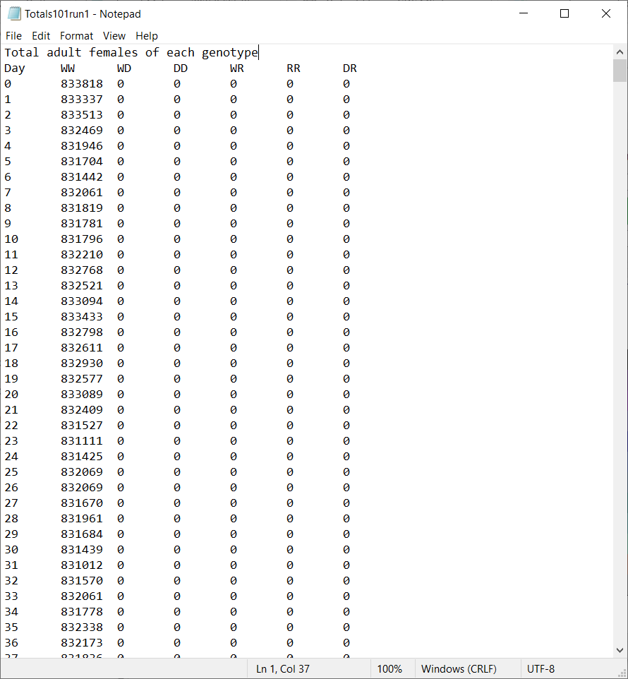
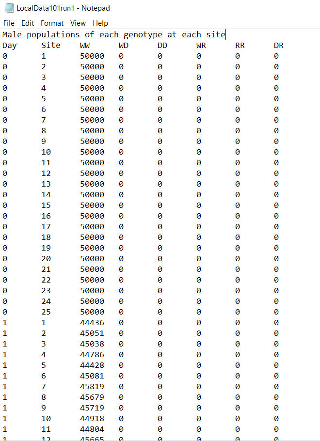

Output files
============

The output files generated are placed in a new subdirectory called ``output_files``. This subdirectory will be located in the ``build`` directory the program runs from. 

A set of three files will be created for each repetition of the simulation (also called run):

- Coordinates file
- Totals file
- Local data file

The naming structure uses the ``set_label`` as the first number of the filename, and then denotes which run. For example, ``LocalData2run1.txt`` would be a local data file for a set labelled '2' and for the first run of the simulation.

.. _coords_output_file:

Coordinates output file
-----------------------

The coordinates file records all the :class:`Patch` (also called site) coordinates. These are 2D Cartesian coordinates.

The first column denotes the site index (a number purely assigned from the order the patches are created). 
The second and third columns contain the `x` and `y` coordinates respectively.

.. image:: ../images/output_coords.png
    :scale: 80 %

.. _totals_file:

Totals file
-----------

The totals file records the total number of adult male mosquitoes over all sites for each day of the simulation. These are divided into the different genotypes available. By default, the program uses 6 genotypes (more information in the :doc:`defaults` section).

The first column denotes the simulation day, where day 0 is the initialisation day. The following columns denote the number of males of each genotype, where W is a wild-type allele, D is a drive-type allele and R is a non-functional resistance allele. 

.. note::
    During the initialisation day, sites are populated with some initial populations and gene drive mosquitoes may be released, but mosquitoes don't carry out their life processes or disperse. This is to set a baseline for the model. Mosquito numbers are always recorded as the very last step of the simulation day.

.. _local_output_file:

Local data file
---------------

Similarly to the totals file, the local data file records the number of adult male mosquitoes for each day of the simulation, but this is split by each site. This provides a more in-depth view of the population evolution at each site. The male population numbers are also divided by genotype. 

The first column again denotes the simulation day, the second column denotes the site index (as seen in :ref:`coords_output_file`) and the following columns denote the number of males of each genotype (as seen in :ref:`totals_file`).

